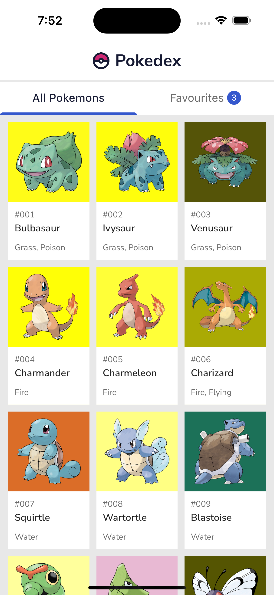
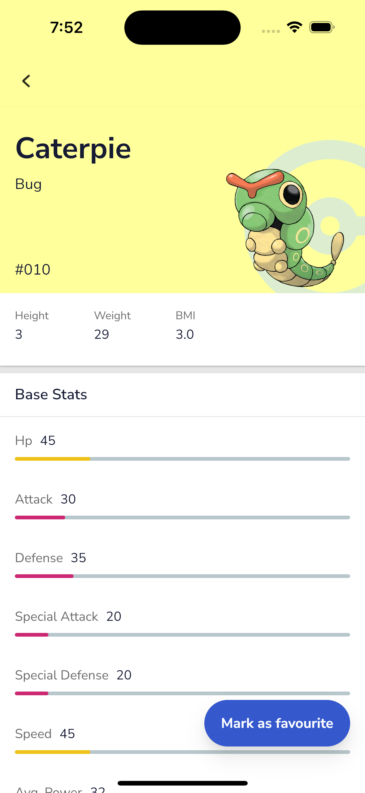
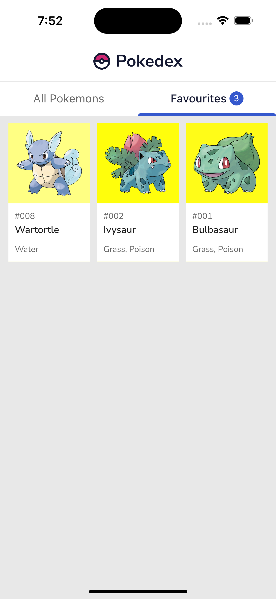

# Pokedex Flutter App Documentation

A basic barebones Mobile app built in Flutter that demonstrates some of my skills in Mobile App Dev using Flutter & Dart.

On the most basic level, it uses Provider for State management, Hive to Store data locally, Isolates to compute JSON data in the background without affecting the app performance and creating Jank and Test package to run Unit Tests.

## Screenshots of the app:

| Splash Screen | Home Screen |
|------|-------|
|||
| 
**Details Screen** | 
**Favourites Screen** |
|||

### How to run the app
- Download the source code 
- Make sure that your `flutter --version` is up to date as well as running on `stable` channel
- Open an Android and/or iOS simulator or connect a  real device to Your computer
- Go int to the root directory of the project and run `flutter pub get`
- After that, run `flutter run` and enyoj the app

### Used Packages 
- **[flutter_native_splash]** - Used to create a Native Splash Screen for both Android ans iOS Devices
- **[http]** - Used to create GET API request to the required Endpoints
- **[provider]** - Used for state managment
- **[cached_network_image]** - Used to cache Network Images on the device
- **[percent_indicator]** - Used to create Percenatge Indicators that show Pokemon's Basic Stats
- **[page_transition]** - Used for Navigation Transitions (Fade Transition)
- **[hive]** & **[hive_flutter]** - Used to store Favourite Pokemons on the Device's Storage

### Used Code Snippets
- [Animated Text](https://gist.github.com/cirediew/9f68acb7aed1296a232a5f846071d2c3)
- [Custom Tab Bar Indictor](https://stackoverflow.com/questions/60207392/flutter-how-to-make-custom-rounded-shape-tab-indicator-with-fixed-height)
- [String Extension](https://stackoverflow.com/questions/29628989/how-to-capitalize-the-first-letter-of-a-string-in-dart)

[//]: # (These are reference links used in the body of this note and get stripped out when the markdown processor does its job. There is no need to format nicely because it shouldn't be seen. Thanks SO - http://stackoverflow.com/questions/4823468/store-comments-in-markdown-syntax)

   [flutter_native_splash]: <https://pub.dev/packages/flutter_native_splash> 
   [http]: <https://pub.dev/packages/http>
   [provider]: <https://pub.dev/packages/provider>
   [cached_network_image]: <https://pub.dev/packages/cached_network_image>
   [percent_indicator]: <https://pub.dev/packages/percent_indicator>
   [page_transition]: <https://pub.dev/packages/page_transition>
   [hive]: <https://pub.dev/packages/hive>
   [hive_flutter]: <https://pub.dev/packages/hive_flutter>